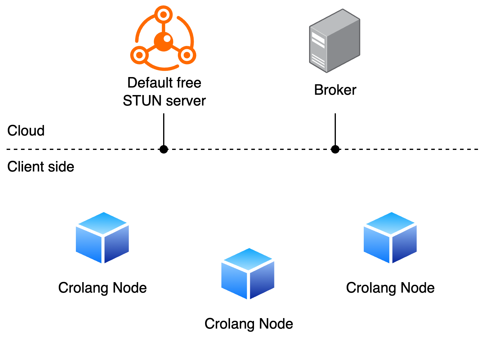
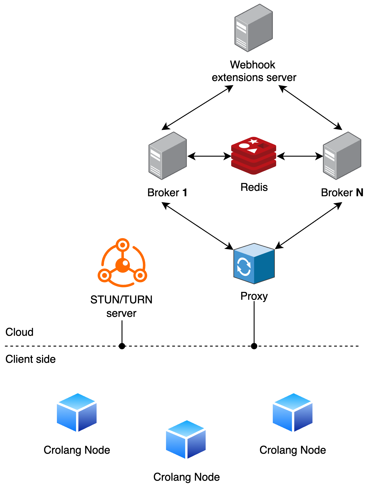

# Crolang Broker Complete Example
TODO

## Table of contents
- [Broker Architecture examples](#broker-architecture-examples)
  - [Standalone architecture](#standalone-architecture)
  - [Extended architecture](#extended-architecture)
  - [Architectures comparison](#architectures-comparison)
- [Running the architecture examples](#running-the-architecture-examples)
  - [Running the standalone example](#running-the-standalone-example)
  - [Running the extended example](#running-the-extended-example)
    - [Generating coturn certificates](#generating-coturn-certificates)
    - [Executing the docker-compose](#executing-the-docker-compose)
- [Modules](#modules)
  - [Nodes ID univocity and messages propagation](#nodes-id-univocity-and-messages-propagation)
  - [Nodes connectivity](#nodes-connectivity)
  - [Nodes authentication](#nodes-authentication)
  - [Nodes connection authorization](#nodes-connection-authorization)
  - [Nodes validity through lifecycle](#nodes-validity-through-lifecycle)
- [License](#license)

## Broker Architecture examples
The Broker service uses a modular approach to allow different architectures to be implemented, from the simplest standalone 
Broker to a more complex setup.  

Adding more capabilities to the Broker service is as simple as adding environment variables for the Broker execution; 
in the following sections we will see how to run the Broker service in different architectures and what that means for 
your project's capabilities.

Although Crolang is designed to simplify as much as possible the exchange of data among peers, keep in mind that said peers
communication is based on [WebRTC](https://webrtc.org/), which is a complex technology.
In order to reliably connect Crolang Nodes among all different network types, additional setup is required as we will see in the next sections.

### Standalone architecture
(See [Running the standalone example](#running-the-standalone-example) for instructions on how to run this architecture example)

Running a single broker instance is the simplest way to use the Crolang Broker.

This is achieved by simply running a Docker container using the Broker image, without any additional setup.


 
As long as the clients are networks that are resolvable by just using STUN servers, they will be able to connect to each other without any additional setup.

Running the project this way uses free STUN servers are used for the WebRTC connections among Crolang Nodes;
by default the project uses [Google's free STUN servers](https://dev.to/alakkadshaw/google-stun-server-list-21n4).

Keep in mind that using only STUN servers may not work in all cases, especially when the clients are behind symmetric NATs.  
To solve this issue, you can use a [TURN server](https://webrtc.org/getting-started/turn-server) (hosted by you or provided by external paid services), which is a more complex but reliable setup.

Depending on your use case, you may be ok with just using STUN servers, but if you need a more reliable setup, you should 
[consider using a TURN server](https://medium.com/@nerdchacha/what-are-stun-and-turn-servers-and-why-do-we-need-them-in-webrtc-9d5b8f96b338).

### Extended architecture
(See [Running the extended example](#running-the-extended-example) for instructions on how to run this architecture example)

This repository provides an example of a more complex setup in the [docker-compose.yml](./docker-compose.yml) file.  

As you can see, the docker compose file specifies the following services:
- A proxy service (to allow the use of multiple Broker replicas)
- Two Broker instances
- A Redis service (required to allow the Broker instances to work properly while not being executed standalone)
- An example webhook extensions server (to show how to extend the Broker service capabilities)
- A STUN/TURN server (coturn) to allow the Crolang Nodes to connect to each other



The two Broker instances are executed passing the following additional environment variables:
- __REDIS_URL__
- __RTC_CONFIGURATION_RESOLVER_WEBHOOK_URL__
- __NODES_AUTHENTICATION_WEBHOOK_URL__
- __AUTHORIZE_NODES_COMMUNICATION_WEBHOOK_URL__
- __NODES_VALIDITY_CHECK_WEBHOOK_URL__

The detailed usage of said variables is explained in the [Modules](#modules) section but, as a general guideline:  
- the Redis URL allows the execution of multiple Broker instances, enabling horizontal scaling
- the webhook URLs allow to specify custom endpoints to customize the Broker behavior is key aspects of a Crolang Node's 
lifecycle; in particular, the RTC webhook defines the logic for retrieving valid RTC configurations that will be used by a 
Crolang Node in order to connect to your STUN/TURN server (coturn in this example).

This repository provides a really simple example of a webhook server; it's implementation can be found in [index.js](./index.js) file.  

Through the use of the webhook services, you can customize the Broker behavior transparently by providing your custom business logic 
using your REST server(s) without the need to modify the Broker service itself.

The example webhook server, other than trivial authentication logic, provides a simple RTC configuration resolver that returns 
credentials for Coturn; said credentials also include a time limitation, ensuring that, even if leaked, said credentials 
will not be used to connect to the TURN server indefinitely, thus increasing the security of the TURN server and preventing 
abuses of your TURN server resources.

Keep in mind that none of these variables are nor required nor related to one another; you can use them independently of
each other and even provide a partial configuration, depending on of what you're trying to achieve.

If you need to customize the behaviour of the Broker service without using the webhooks,
feel free to fork the [Broker's repository](https://github.com/crolang/broker) and modify the code as you see fit.

### Architectures comparison
This table summarizes the differences between the standalone and extended architectures:

|                                    | Standalone                                                                                                                          | Extended                                                                                                                                                                                           |
|------------------------------------|-------------------------------------------------------------------------------------------------------------------------------------|----------------------------------------------------------------------------------------------------------------------------------------------------------------------------------------------------|
| Simplicity                         | As simple as it can get. Just by running the Broker service you're ready to go                                                      | Requires additional setup to customize logic and enhance nodes connectivity                                                                                                                        |
| Horizontal scalability             | No horizontal scalability                                                                                                           | Allows to add multiple Broker  instances without an impact on the Nodes that will always see the  Broker as just one entity                                                                        |
| Nodes connectivity capabilities    | Nodes will connect among each other  as long as their networks allow them to resolve the connection by just  using the STUN servers | Nodes will always connect among each  other bypassing networks limitations by using a combination of STUN and  TURN servers; credentials fo said servers will be obtained by the provided endpoint |
| Nodes authentication to the Broker | As long as no other Node with the same ID is connected, the connecting Node will always be authenticated successfully               | The limit on ID duplicates will be maintained but the custom  authentication logic provided by the endpoint will be enforced                                                                       |
| Nodes communication authorization  | Two connected Nodes will always be able to exchange messages through the Broker in order to establish their connection              | Two connected Nodes will be able to exchange messages through the Broker in order to establish their connection only if the custom logic provided by the endpoint will allow them to               |
| Nodes validity through lifecycle   | Nodes connected to the Broker will always be considered valid                                                                       | The Broker will periodically check for its connected nodes validity by using the custom logic provided by the endpoint (e.g. a Node gets banned and needs to be disconnected)                      |

## Running the architecture examples

### Running the standalone example
Running a single broker instance is the simplest way to use the Crolang Broker.

On a terminal, run the following command:
```bash
docker run --rm --name broker-service -p 8080:8080 alessandrotalmi/broker-service
```
This will run a single Broker instance on the default port 8080 and won't require any additional setup.

Once the service is running, try connecting to it using any Crolang Node client implementation, using __http://localhost:8080__ as the Broker address.  
As long as the clients are networks that are resolvable by just using STUN servers, they will be able to connect to each other without any additional setup.

### Running the extended example
#### Generating coturn certificates
In order to run the coturn service, you need to generate some certificates for the coturn service.  

To generate said certificates, run the following command:

```bash
openssl req -x509 -newkey rsa:4096 -keyout coturn-config/turn_server_key.pem -out coturn-config/turn_server_cert.pem -days 365 -nodes
```

This will generate the following files:
- `coturn-config/turn_server_key.pem`
- `coturn-config/turn_server_cert.pem`

The coturn service will use these files to establish a secure connection; the certificates will last for 365 days.

#### Executing the docker-compose

After generating the certificates, you can run the complete example.

On a terminal, run the following command:

```bash
docker-compose up --build
```

This will start all the services specified in the [docker-compose.yml](./docker-compose.yml) file.

When connecting from any Crolang Node client implementation, simply use __http://localhost:8080__ as the broker address.

## Modules
As previously discussed, the Broker service uses a modular approach to allow the expansion of its capabilities.

Expanding the Broker capabilities is as simple as providing the right environment variables to the Broker service; said
variables are listed in the following sections.

### Nodes ID univocity and messages propagation
Environment variable: __REDIS_URL__  

The Broker service ensures that only one Node with a specific ID is connected to the Grid at any given time.
Furthermore, the Broker(s) are responsible for propagating the messages between the connected Nodes in the connection negotiation process.

Running the Broker service in standalone mode is simple, because having only one instance you can check locally the IDs of the connected nodes and, 
through Socket.io events, the messages are propagated from a sender to the right receiver.

On the other hand, running the Broker service in extended mode requires additional setup. 
For example, let's say that we run two Broker instances A and B and two Nodes, X and Y; if the Node X connects to Broker 
A and the Node Y connects to Broker B (leaving this decision to the proxy), we now have a problem since A cannot know about Y and B cannot know about X.  
If X needs to connect with Y, A would not be able to propagate the message to B and vice versa. Furthermore, if another Node tries 
to authenticate using X's ID and the proxy redirects its connection attempt to the Broker B, the Broker B would not be able to tell that the Node X is already connected to Broker A.  
Having unique IDs is a key aspect since, from the Node's perspective, you need to know exactly who you are talking to.

To solve this problem, it is possible to use the REDIS_URL environment variable to specify the Redis service URL.  
Through the use of Redis, the Broker instances can share the connected Nodes IDs and propagate the messages between among every Broker instance flawlessly.

The usage of Redis is necessary if horizontal scalability is required.

If on the other hand the REDIS_URL environment variable is not provided, the Broker will assume it is running standalone without any other Broker replicas, 
using an in-memory approach.

### Nodes connectivity
Environment variable: __RTC_CONFIGURATION_RESOLVER_WEBHOOK_URL__  

Being based on WebRTC, Crolang Nodes need to exchange ICE candidates in order to establish a connection.
ICE (Interactive Connectivity Establishment) is a framework that allows WebRTC peers to discover possible network paths 
they can use to communicate. 
Each ICE candidate represents a potential connection method, including direct peer-to-peer connections, connections 
through NAT traversal, or relayed connections if necessary.

STUN (Session Traversal Utilities for NAT) servers help WebRTC peers determine their public IP address and the type of 
NAT they are behind.
This is crucial because, in many cases, devices are connected to the internet via a private IP (e.g., inside a home or 
office network), and they need to know their external IP to establish a direct connection with another peer. 
STUN servers facilitate this by responding with the public IP and port from which the request was received, allowing the 
client to use this information when exchanging ICE candidates.

While STUN works well when both peers are behind NATs that allow direct connections, some network configurations make 
peer-to-peer connections impossible. This can happen in cases where:

- One or both peers are behind symmetric NATs, which assign a different external port for each destination.
- Strict firewall rules block direct UDP traffic between peers.

In such scenarios, TURN (Traversal Using Relays around NAT) servers act as a relay between the two peers. 
Instead of establishing a direct connection, both peers send their data to the TURN server, which then forwards it to 
the other peer. This ensures connectivity even in the most restrictive network conditions, but it comes at a cost: 
TURN increases latency and requires additional bandwidth on the relay server.
Since the TURN server is a relay, it has its cost based on traffic redirection, that's why you will only find free STUN 
servers online.

If the __RTC_CONFIGURATION_RESOLVER_WEBHOOK_URL__ environment variable is not provided, the Broker will use the default 
RTC configuration resolver which provides a reference to the [Google's free STUN servers](https://dev.to/alakkadshaw/google-stun-server-list-21n4);
on the other hand, if you provide a custom endpoint, this endpoint will be called every time a Crolang Node successfully 
connects to the Broker, providing such Node with the RTC configuration to connect to the STUN/TURN server.

The endpoint must be structured as follows:
- Method: POST
- Body: JSON object with the following structure:
  ```json
  {
    "nodeId": "string"
  }
  ```
- Response: JSON object with the following structure:
  ```json
  {
    "iceServers": [
      {
        "urls": [],
        "username": "string",
        "password": "string"
      }
    ],
    "iceTransportPolicy": "string",
    "bundlePolicy": "string",
    "rtcpMuxPolicy": "string",
    "iceCandidatePoolSize": "number"
  }
  ```
The only required field is the `iceServers` array, which must contain at least one object with the __urls__ field populated.  
The __username__ and __password__ fields are required if your STUN/TURN server requires authentication.

See the [index.js](./index.js) file for an example of a simple RTC configuration resolver using Coturn; that example also 
shows you how to create a time-limited credential for the TURN server, ensuring that even if the credentials are leaked 
an attacker cannot use them indefinitely exploiting your TURN server resources.

Keep in mind that if you need a TURN server, but you don't want to host it yourself, you can use external paid services 
ad still resolve the RTC configuration through your custom endpoint.

### Nodes authentication

Environment variable: __NODES_AUTHENTICATION_WEBHOOK_URL__

The Broker service ensures that only one Node with a specific ID is connected to the Grid at any given time by default 
and this behaviour cannot be changed and will always be enforced, independently of the status of the 
NODES_AUTHENTICATION_WEBHOOK_URL environment variable; this expansion is useful when you need to add custom 
authentication logic on top of the unique ID check.

By default, the Broker will allow any Node to connect to it; if the endpoint is provided, it will be called every
time a Node tries to connect to the Broker.

The endpoint must be structured as follows:
- Method: POST
- Body: JSON object with the following structure:
  ```json
  {
    "nodeId": "string",
    "data": "object"
  }
  ```
- Response: JSON object with the following structure:
  ```json
  {
    "authenticated": "boolean"
  }
  ```
TODO explain the data field

See the [index.js](./index.js) file for an example of a simple authentication endpoint.

### Nodes connection authorization
Environment variable: __AUTHORIZE_NODES_COMMUNICATION_WEBHOOK_URL__

While two Nodes connected to a Broker will attempt to establish a connection, they will exchange messages through the 
Broker in order to establish their connection; by default, the Broker will allow any two connected Nodes to exchange 
messages for the connection negotiation process.

If the __AUTHORIZE_NODES_COMMUNICATION_WEBHOOK_URL__ environment variable is provided, the Broker will call the endpoint
every time two Nodes try to exchange messages through the Broker, determining whether establishing a P2P connection
between the two Nodes is allowed.

The endpoint must be structured as follows:
- Method: POST
- Body: JSON object with the following structure:
  ```json
  {
    "from": "string",
    "to": "string"
  }
  ```
- Response: JSON object with the following structure:
  ```json
  {
    "authorized": "boolean"
  }
  ```
Every field is required; the __from__ field represents the Node ID of the sender, while the __to__ field represents the
Node ID of the receiver.

See the [index.js](./index.js) file for an example of a simple communication authorization endpoint.

### Nodes validity through lifecycle
Environment variable: __NODES_VALIDITY_CHECK_WEBHOOK_URL__

It can happen that, if the business logic requires so, a Node that is currently connected to the Broker needs to be 
disconnected; this can happen for various reasons, such as a Node being banned.

By default, the Broker will always consider the connected Nodes as valid; if the __NODES_VALIDITY_CHECK_WEBHOOK_URL__ 
environment variable is provided, the Broker will call the endpoint periodically to check if the connected Nodes are still 
valid.

The endpoint must be structured as follows:
- Method: POST
- Body: JSON object with the following structure:
  ```json
  {
    "connectedNodesIds": []
  }
  ```
- Response: JSON object with the following structure:
  ```json
  {
    "invalidNodesIds": []
  }
  ```
The __connectedNodesIds__ field is an array of strings representing the IDs of the Nodes currently connected to the Broker, while the 
__invalidNodesIds__ field is an array of strings representing the IDs of the Nodes that need to be disconnected.

## License
This project is licensed under the MIT License - see the [LICENSE](./LICENSE.md) file for details.